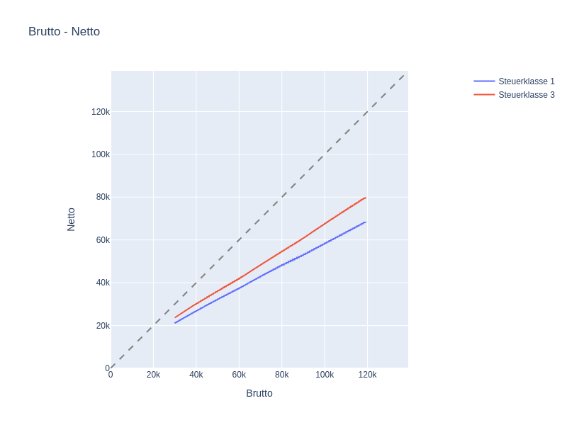

This is a project about the difference between brutto and netto income in Germany.
First we are collecting the necessary data and then we are visualising the situation in a plotly chart.
This is just a harsh reality...

